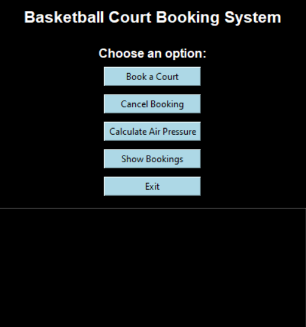
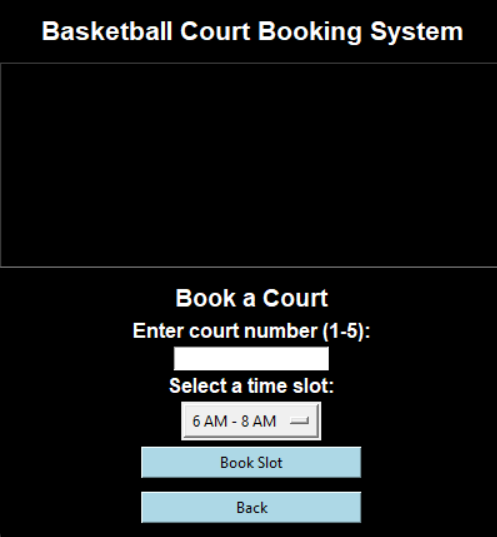

# Basketball Court Booking System

The Basketball Court Booking System is a simple desktop application built with Python and Tkinter that allows users to book and manage basketball court reservations. This system also includes additional features such as calculating the recommended air pressure for a basketball based on its weight.

## Features

- **Book a Court:** Users can book a basketball court by selecting a time slot and court number.
- **Cancel Booking:** Users can cancel an existing booking.
- **View Current Bookings:** Users can view the current booking status for all courts and time slots.
- **Calculate Air Pressure:** Users can calculate the recommended air pressure for a basketball based on its weight.

## Screenshots

### Home Page


### Booking Sample


## Installation

To run this application locally, follow these steps:

1. **Clone the repository:**

    ```bash
    git clone https://github.com/amiteshsrinivas/Basketball-Court-Booking.git
    ```

2. **Navigate to the project directory:**

    ```bash
    cd Basketball-Court-Booking
    ```

3. **Run the application:**

    ```bash
    python basketball.py
    ```

## Usage

- **Book a Court:** Enter the court number (1-5) and select a time slot to book the court.
- **Cancel Booking:** Enter the court number and time slot to cancel an existing booking.
- **Calculate Air Pressure:** Input the basketball weight to calculate the recommended air pressure.
- **Show Bookings:** View the current booking status for all courts and time slots.

## Contributing

Feel free to contribute to the project by submitting a pull request or opening an issue.

## License

This project is licensed under the MIT License.

